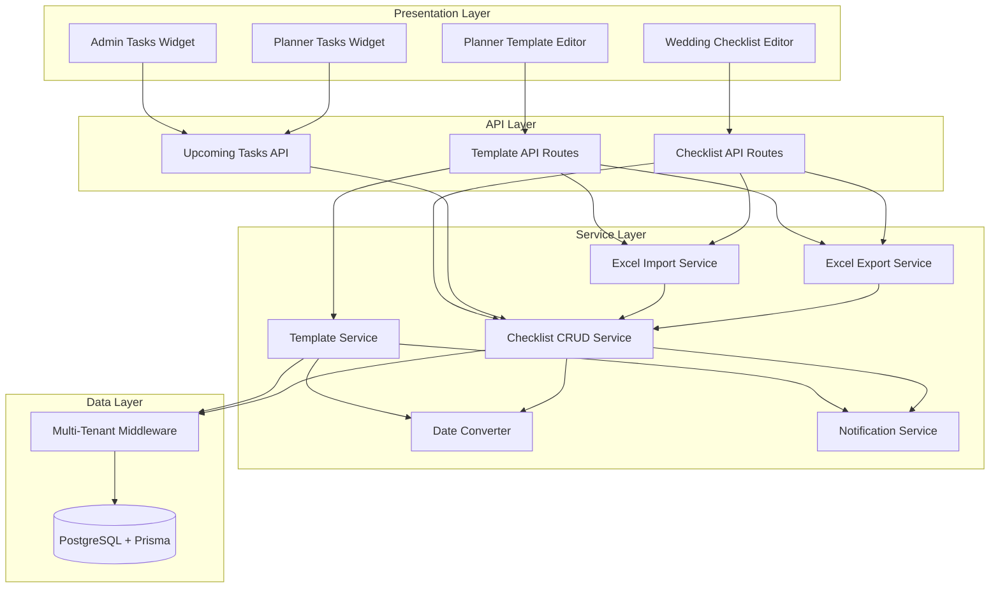

# Design Document

## Overview

The Wedding Checklist feature introduces a comprehensive task management system that enables wedding planners to create reusable task templates and allows both planners and wedding admins to collaboratively manage wedding-specific checklists. The system automatically copies templates to new weddings, converts relative due dates to absolute dates, provides Excel import/export capabilities, sends notifications for task assignments and completions, and displays upcoming tasks on both admin and planner dashboards.

This feature integrates seamlessly with the existing multi-tenant architecture, leveraging established patterns for Excel processing, notifications, API routes, and database access. The design emphasizes modular code organization, reuse of existing utilities, and mobile-first user experience.

## Steering Document Alignment

### Technical Standards (tech.md)

The design follows all documented technical patterns:

1. **Next.js 14+ with App Router**: API routes at `/api/planner/checklist-template/*` and `/api/admin/checklist/*` following existing route organization
2. **PostgreSQL + Prisma ORM**: New models (ChecklistTemplate, ChecklistTask, ChecklistSection) with type-safe access
3. **Mobile-First Design with Tailwind CSS**: Grid interface responsive with card layout on mobile, full grid on desktop
4. **Multi-Tenancy via Prisma Middleware**: Automatic `wedding_id` filtering for checklist tasks, `planner_id` filtering for templates
5. **Excel Integration**: Reuse existing `src/lib/excel/import.ts` and `export.ts` patterns
6. **Notification System**: Leverage existing `Notification` model and notification creation patterns
7. **TypeScript Strict Mode**: Full type safety with Zod validation schemas for API inputs

### Project Structure (structure.md)

The implementation follows project organization conventions:

**API Routes**:
- `src/app/api/planner/checklist-template/route.ts` - Template CRUD
- `src/app/api/planner/checklist-template/export/route.ts` - Template export
- `src/app/api/planner/checklist-template/import/route.ts` - Template import
- `src/app/api/admin/checklist/route.ts` - Checklist CRUD
- `src/app/api/admin/checklist/export/route.ts` - Checklist export
- `src/app/api/admin/checklist/import/route.ts` - Checklist import
- `src/app/api/admin/upcoming-tasks/route.ts` - Admin upcoming tasks widget
- `src/app/api/planner/upcoming-tasks/route.ts` - Planner upcoming tasks widget

**UI Components**:
- `src/components/planner/ChecklistTemplateEditor.tsx` - Template editor grid
- `src/components/admin/ChecklistEditor.tsx` - Wedding checklist grid
- `src/components/admin/UpcomingTasksWidget.tsx` - Admin dashboard widget
- `src/components/planner/UpcomingTasksWidget.tsx` - Planner dashboard widget
- `src/components/ui/TaskRow.tsx` - Shared task row component
- `src/components/ui/RichTextEditor.tsx` - Rich text description editor
- `src/components/ui/DatePicker.tsx` - Date picker with relative date support

**Services**:
- `src/lib/checklist/template.ts` - Template management service
- `src/lib/checklist/crud.ts` - Checklist CRUD operations
- `src/lib/checklist/date-converter.ts` - Relative to absolute date conversion
- `src/lib/checklist/excel-import.ts` - Checklist Excel import
- `src/lib/checklist/excel-export.ts` - Checklist Excel export
- `src/lib/checklist/notifications.ts` - Task notification creation

## Code Reuse Analysis

### Existing Components to Leverage

1. **Excel Processing (`src/lib/excel/`)**
   - **import.ts**: Reuse validation patterns, error handling, transaction logic
   - **export.ts**: Reuse workbook creation, column width setting, buffer generation
   - **templates.ts**: Extend to support checklist templates
   - *How*: Create `src/lib/checklist/excel-import.ts` and `excel-export.ts` that follow the same patterns but with checklist-specific schemas

2. **Notification System (`src/lib/notifications/`)**
   - **invitation.ts**: Reuse notification creation patterns
   - **Notification model**: Store task assignment/completion notifications
   - *How*: Create `src/lib/checklist/notifications.ts` that creates notifications using the same `prisma.notification.create()` pattern with checklist-specific event types

3. **UI Components (`src/components/ui/`)**
   - **LanguageSwitcher.tsx**: Reference for dropdown patterns
   - *How*: Create similar dropdown for "Assigned To" field, date pickers, and section selectors

4. **Database Middleware (`src/lib/db/middleware.ts`)**
   - **Multi-tenancy filtering**: Automatically enforces `wedding_id` on ChecklistTask queries
   - *How*: Extend middleware to include new checklist models in tenant filtering

5. **API Route Patterns (`src/app/api/`)**
   - **admin/guests/route.ts**: Reference for CRUD operations with authentication
   - **admin/guests/export/route.ts**: Reference for Excel export endpoints
   - **admin/notifications/route.ts**: Reference for notification querying
   - *How*: Follow identical authentication, validation, and error handling patterns

### Integration Points

1. **Wedding Creation Flow**
   - **When**: New wedding is created in `src/app/api/planner/weddings/route.ts`
   - **How**: Add hook to copy planner's template to new wedding checklist
   - **Service**: `src/lib/checklist/template.ts#copyTemplateToWedding()`

2. **Notification Feed**
   - **Existing**: `src/app/api/admin/notifications/route.ts` queries notifications
   - **How**: Add checklist event types to EventType enum, filter by task events
   - **UI**: Notification feed already supports filtering by event type

3. **Dashboard Widgets**
   - **Admin Dashboard**: `/app/admin/page.tsx` - add `<UpcomingTasksWidget />` component
   - **Planner Dashboard**: `/app/planner/page.tsx` - add `<UpcomingTasksWidget />` component
   - **How**: Widgets fetch data from new API endpoints and display in existing dashboard layout

4. **Database Schema**
   - **Existing**: `prisma/schema.prisma` with Wedding, WeddingAdmin, WeddingPlanner models
   - **How**: Add ChecklistTemplate, ChecklistSection, ChecklistTask models with proper relations and indexes

5. **Multi-Language Support**
   - **Existing**: `src/lib/i18n/` with translation infrastructure
   - **How**: Add translations for task assignment dropdown values, widget headings, notification messages

## Architecture

The checklist system follows a layered architecture with clear separation of concerns:

```
┌─────────────────────────────────────────────────────────────┐
│                    Presentation Layer                        │
│  (React Components - Template Editor, Checklist Editor)     │
└──────────────────────┬──────────────────────────────────────┘
                       │
┌──────────────────────┴──────────────────────────────────────┐
│                      API Layer                               │
│  (Next.js API Routes - Authentication, Validation, Routing) │
└──────────────────────┬──────────────────────────────────────┘
                       │
┌──────────────────────┴──────────────────────────────────────┐
│                    Service Layer                             │
│  (Business Logic - Template Copy, Date Conversion,          │
│   Excel Processing, Notification Creation)                  │
└──────────────────────┬──────────────────────────────────────┘
                       │
┌──────────────────────┴──────────────────────────────────────┐
│                     Data Layer                               │
│  (Prisma ORM - Database Access with Multi-Tenant Filtering) │
└─────────────────────────────────────────────────────────────┘
```

### Modular Design Principles

1. **Single File Responsibility**
   - `template.ts`: Only handles template CRUD and copying
   - `crud.ts`: Only handles checklist task CRUD
   - `date-converter.ts`: Only handles date conversions
   - `excel-import.ts`: Only handles Excel import logic
   - `excel-export.ts`: Only handles Excel export logic
   - `notifications.ts`: Only handles notification creation

2. **Component Isolation**
   - `TaskRow.tsx`: Single task row (40-60 lines)
   - `ChecklistTemplateEditor.tsx`: Template editor layout (150-200 lines)
   - `ChecklistEditor.tsx`: Reuses ChecklistTemplateEditor with slight modifications
   - `RichTextEditor.tsx`: Standalone rich text component (100-150 lines)
   - `UpcomingTasksWidget.tsx`: Standalone widget (80-120 lines)

3. **Service Layer Separation**
   - API routes only handle request/response, authentication, validation
   - All business logic lives in `src/lib/checklist/` services
   - Services are pure functions that can be tested independently

4. **Utility Modularity**
   - Date conversion: `convertRelativeDateToAbsolute(relativeDate, weddingDate)`
   - Validation: Zod schemas for task, section, template structures
   - Sanitization: HTML sanitizer for rich text descriptions

### Architecture Diagram



## Components and Interfaces

### Component 1: Template Management Service

**File**: `src/lib/checklist/template.ts`

**Purpose**: Manage checklist templates for wedding planners (create, read, update, delete, copy to wedding)

**Interfaces**:
```typescript
export interface CreateTemplateData {
  planner_id: string;
  sections: Array<{
    name: string;
    order: number;
    tasks: Array<{
      title: string;
      description: string | null;
      assigned_to: 'WEDDING_PLANNER' | 'COUPLE' | 'OTHER';
      due_date_relative: string | null; // e.g., "WEDDING_DATE-90" (90 days before)
      order: number;
    }>;
  }>;
}

export async function getTemplate(planner_id: string): Promise<ChecklistTemplate | null>
export async function saveTemplate(planner_id: string, data: CreateTemplateData): Promise<ChecklistTemplate>
export async function copyTemplateToWedding(planner_id: string, wedding_id: string): Promise<void>
export async function deleteTemplate(planner_id: string): Promise<void>
```

**Dependencies**:
- Prisma client for database access
- Date converter service for relative date handling
- Validation schemas (Zod)

**Reuses**:
- Database transaction patterns from `src/lib/excel/import.ts`
- Error handling patterns from existing services

### Component 2: Checklist CRUD Service

**File**: `src/lib/checklist/crud.ts`

**Purpose**: Manage wedding-specific checklist tasks (create, read, update, delete, reorder)

**Interfaces**:
```typescript
export interface ChecklistTaskData {
  wedding_id: string;
  section_id: string | null;
  title: string;
  description: string | null;
  assigned_to: 'WEDDING_PLANNER' | 'COUPLE' | 'OTHER';
  due_date: Date | null;
  status: 'PENDING' | 'IN_PROGRESS' | 'COMPLETED';
  completed: boolean;
  order: number;
}

export async function getChecklist(wedding_id: string): Promise<ChecklistWithSections>
export async function createTask(data: ChecklistTaskData): Promise<ChecklistTask>
export async function updateTask(task_id: string, wedding_id: string, data: Partial<ChecklistTaskData>): Promise<ChecklistTask>
export async function deleteTask(task_id: string, wedding_id: string): Promise<void>
export async function reorderTasks(wedding_id: string, taskOrders: Array<{id: string, order: number}>): Promise<void>
export async function getUpcomingTasks(wedding_id: string, assigned_to: string, limit: number): Promise<ChecklistTask[]>
```

**Dependencies**:
- Prisma client
- Notification service for assignment/completion notifications
- Multi-tenant middleware for automatic `wedding_id` filtering

**Reuses**:
- CRUD patterns from `src/lib/guests/crud.ts`
- Query optimization patterns

### Component 3: Date Converter Service

**File**: `src/lib/checklist/date-converter.ts`

**Purpose**: Convert relative dates (e.g., "WEDDING_DATE-90") to absolute dates based on wedding date

**Interfaces**:
```typescript
export type RelativeDateFormat =
  | `WEDDING_DATE${'+' | '-'}${number}` // e.g., "WEDDING_DATE-90", "WEDDING_DATE+7"
  | 'WEDDING_DATE';

export function parseRelativeDate(relativeDate: string): { offset: number } | null
export function convertRelativeDateToAbsolute(relativeDate: RelativeDateFormat, weddingDate: Date): Date
export function convertAbsoluteDateToRelative(absoluteDate: Date, weddingDate: Date): RelativeDateFormat
export function isValidRelativeDateFormat(value: string): boolean
```

**Dependencies**: None (pure utility functions)

**Reuses**: Date formatting patterns from `src/lib/utils/date.ts`

### Component 4: Excel Import Service

**File**: `src/lib/checklist/excel-import.ts`

**Purpose**: Import checklist tasks from Excel files with validation and preview

**Interfaces**:
```typescript
export interface ChecklistImportRow {
  section: string;
  title: string;
  description: string | null;
  assigned_to: 'WEDDING_PLANNER' | 'COUPLE' | 'OTHER';
  due_date: string; // Can be relative or absolute
  status: 'PENDING' | 'IN_PROGRESS' | 'COMPLETED';
}

export interface ImportPreview {
  newTasks: number;
  updatedTasks: number;
  sections: string[];
  rows: ChecklistImportRow[];
}

export interface ImportResult {
  success: boolean;
  tasksCreated: number;
  tasksUpdated: number;
  errors: ValidationError[];
  warnings: ValidationWarning[];
}

export async function parseChecklistExcel(buffer: Buffer): Promise<ChecklistImportRow[]>
export async function validateImportData(rows: ChecklistImportRow[], weddingDate: Date): Promise<{errors: ValidationError[], warnings: ValidationWarning[]}>
export async function previewImport(wedding_id: string, rows: ChecklistImportRow[]): Promise<ImportPreview>
export async function importChecklist(wedding_id: string, rows: ChecklistImportRow[], weddingDate: Date): Promise<ImportResult>
```

**Dependencies**:
- xlsx library
- Checklist CRUD service
- Date converter service
- Zod validation schemas

**Reuses**:
- Excel parsing logic from `src/lib/excel/import.ts`
- Validation patterns and error structures

### Component 5: Excel Export Service

**File**: `src/lib/checklist/excel-export.ts`

**Purpose**: Export checklist tasks to Excel files

**Interfaces**:
```typescript
export interface ExportOptions {
  format?: 'xlsx' | 'csv';
  includeCompleted?: boolean;
  relativeDates?: boolean; // For template export
}

export interface ExportResult {
  buffer: Buffer;
  filename: string;
  mimeType: string;
}

export async function exportChecklistTemplate(planner_id: string, options?: ExportOptions): Promise<ExportResult>
export async function exportWeddingChecklist(wedding_id: string, options?: ExportOptions): Promise<ExportResult>
export function generateChecklistExcelTemplate(): ExportResult
```

**Dependencies**:
- xlsx library
- Prisma client for data fetching

**Reuses**:
- Excel generation patterns from `src/lib/excel/export.ts`
- Workbook creation and formatting

### Component 6: Notification Service

**File**: `src/lib/checklist/notifications.ts`

**Purpose**: Create notifications for task assignments and completions

**Interfaces**:
```typescript
export interface TaskNotificationData {
  wedding_id: string;
  task_id: string;
  task_title: string;
  assigned_to: string;
  event_type: 'TASK_ASSIGNED' | 'TASK_COMPLETED';
  admin_id: string;
  completed_by?: string;
}

export async function createTaskAssignedNotification(data: TaskNotificationData): Promise<void>
export async function createTaskCompletedNotification(data: TaskNotificationData): Promise<void>
```

**Dependencies**:
- Prisma client
- Notification model

**Reuses**:
- Notification creation patterns from `src/lib/notifications/invitation.ts`

### Component 7: Checklist Template Editor (UI)

**File**: `src/components/planner/ChecklistTemplateEditor.tsx`

**Purpose**: Grid interface for planners to edit task templates

**Interfaces** (Props):
```typescript
interface ChecklistTemplateEditorProps {
  planner_id: string;
  onSave: () => void;
}
```

**Dependencies**:
- TaskRow component
- RichTextEditor component
- DatePicker component
- Fetch from `/api/planner/checklist-template`

**Reuses**:
- Table/grid patterns from existing admin components
- Form handling patterns

### Component 8: Wedding Checklist Editor (UI)

**File**: `src/components/admin/ChecklistEditor.tsx`

**Purpose**: Grid interface for planners and admins to edit wedding checklist

**Interfaces** (Props):
```typescript
interface ChecklistEditorProps {
  wedding_id: string;
  user_role: 'planner' | 'admin';
}
```

**Dependencies**:
- TaskRow component (shared with template editor)
- RichTextEditor component
- DatePicker component
- Fetch from `/api/admin/checklist`

**Reuses**:
- Most layout and logic from ChecklistTemplateEditor
- Different API endpoints and date handling (absolute vs. relative)

### Component 9: Upcoming Tasks Widget (UI)

**File**: `src/components/admin/UpcomingTasksWidget.tsx` and `src/components/planner/UpcomingTasksWidget.tsx`

**Purpose**: Display upcoming tasks on dashboards with color-coded due dates

**Interfaces** (Props):
```typescript
// Admin version
interface AdminUpcomingTasksWidgetProps {
  wedding_id: string;
}

// Planner version
interface PlannerUpcomingTasksWidgetProps {
  planner_id: string;
}
```

**Dependencies**:
- Fetch from `/api/admin/upcoming-tasks` or `/api/planner/upcoming-tasks`
- Date utility functions for color coding

**Reuses**:
- Dashboard widget patterns from existing components

### Component 10: Rich Text Editor (UI)

**File**: `src/components/ui/RichTextEditor.tsx`

**Purpose**: Inline rich text editor for task descriptions with URL support

**Interfaces** (Props):
```typescript
interface RichTextEditorProps {
  value: string;
  onChange: (value: string) => void;
  placeholder?: string;
  maxLength?: number;
}
```

**Dependencies**:
- DOMPurify for sanitization
- Prosemirror or Tiptap library (or simple contenteditable with formatting buttons)

**Reuses**:
- Input component patterns from `src/components/ui/`

## Data Models

### Model 1: ChecklistTemplate

```typescript
model ChecklistTemplate {
  id          String   @id @default(uuid())
  planner_id  String   @unique // One template per planner
  created_at  DateTime @default(now())
  updated_at  DateTime @updatedAt

  planner  WeddingPlanner        @relation(fields: [planner_id], references: [id], onDelete: Cascade)
  sections ChecklistSection[]

  @@index([planner_id])
  @@map("checklist_templates")
}
```

**Purpose**: Stores the template created by each wedding planner (one-to-one relationship)

### Model 2: ChecklistSection

```typescript
model ChecklistSection {
  id          String   @id @default(uuid())
  template_id String?  // Null if section belongs to wedding checklist
  wedding_id  String?  // Null if section belongs to template
  name        String
  order       Int      @default(0)
  created_at  DateTime @default(now())
  updated_at  DateTime @updatedAt

  template ChecklistTemplate? @relation(fields: [template_id], references: [id], onDelete: Cascade)
  wedding  Wedding?            @relation(fields: [wedding_id], references: [id], onDelete: Cascade)
  tasks    ChecklistTask[]

  @@index([template_id])
  @@index([wedding_id])
  @@index([order])
  @@map("checklist_sections")
}
```

**Purpose**: Organizes tasks into named sections (e.g., "Initial Tasks", "Wedding Week Tasks")

**Design Decision**: Sections can belong to either a template OR a wedding checklist (not both). This allows flexible section management.

### Model 3: ChecklistTask

```typescript
enum TaskAssignment {
  WEDDING_PLANNER
  COUPLE
  OTHER
}

enum TaskStatus {
  PENDING
  IN_PROGRESS
  COMPLETED
}

model ChecklistTask {
  id                  String         @id @default(uuid())
  section_id          String?        // Null if task not in a section
  wedding_id          String?        // Null if task belongs to template
  template_id         String?        // Null if task belongs to wedding
  title               String
  description         String?        @db.Text // Rich text content
  assigned_to         TaskAssignment @default(COUPLE)
  due_date            DateTime?      // Absolute date for wedding tasks
  due_date_relative   String?        // Relative date for template tasks (e.g., "WEDDING_DATE-90")
  status              TaskStatus     @default(PENDING)
  completed           Boolean        @default(false)
  completed_at        DateTime?
  completed_by        String?        // User ID who completed the task
  order               Int            @default(0)
  created_at          DateTime       @default(now())
  updated_at          DateTime       @updatedAt

  section  ChecklistSection?  @relation(fields: [section_id], references: [id], onDelete: SetNull)
  wedding  Wedding?           @relation(fields: [wedding_id], references: [id], onDelete: Cascade)
  template ChecklistTemplate? @relation(fields: [template_id], references: [id], onDelete: Cascade)

  @@index([section_id])
  @@index([wedding_id])
  @@index([template_id])
  @@index([status])
  @@index([assigned_to])
  @@index([due_date])
  @@index([completed])
  @@index([order])
  @@map("checklist_tasks")
}
```

**Purpose**: Represents a single task in a template or wedding checklist

**Design Decisions**:
- **completed** field separate from **status** for explicit checkbox state
- **due_date_relative** for template tasks, **due_date** for wedding tasks
- **completed_by** tracks who completed the task for notification purposes
- **order** field enables drag-and-drop reordering

### Model 4: EventType Enum Extension

```typescript
enum EventType {
  // ... existing values
  TASK_ASSIGNED
  TASK_COMPLETED
}
```

**Purpose**: Extend existing EventType enum to support checklist notifications

## Error Handling

### Error Scenarios

1. **Scenario: Template Not Found**
   - **When**: Planner tries to edit template that doesn't exist
   - **Handling**: Return 404 with message "Template not found for this planner"
   - **User Impact**: Display empty template editor with "Create your first template" message

2. **Scenario: Wedding Not Found or Access Denied**
   - **When**: User tries to access checklist for wedding they don't have permission for
   - **Handling**: API returns 403 Forbidden or 404 Not Found
   - **User Impact**: Redirect to dashboard with error toast "You don't have access to this wedding"

3. **Scenario: Excel Import Validation Failure**
   - **When**: Uploaded Excel file has invalid data (missing required fields, invalid dates, etc.)
   - **Handling**: Return 400 with detailed error list including row numbers and field names
   - **User Impact**: Display validation errors in a list: "Row 5: Title is required", "Row 12: Invalid date format"

4. **Scenario: Concurrent Task Edits**
   - **When**: Planner and admin edit the same task simultaneously
   - **Handling**: Last-write-wins with optimistic locking (check `updated_at` timestamp)
   - **User Impact**: If conflict detected, show warning "This task was recently modified. Your changes will overwrite the previous update."

5. **Scenario: Excel File Too Large**
   - **When**: User uploads Excel file > 10MB
   - **Handling**: Reject upload before parsing, return 413 Payload Too Large
   - **User Impact**: Display error "File is too large. Maximum size is 10MB."

6. **Scenario: Invalid Relative Date Format**
   - **When**: Template contains invalid relative date string (e.g., "WEDDING_DATE-ABC")
   - **Handling**: Validation error during save, return 400 with specific error
   - **User Impact**: Display error "Invalid due date format. Use format: WEDDING_DATE+30 or WEDDING_DATE-90"

7. **Scenario: Task Assignment Notification Failure**
   - **When**: Notification creation fails due to database error
   - **Handling**: Log error, but don't fail the task creation (notifications are non-critical)
   - **User Impact**: Task is created successfully, notification may not appear (acceptable)

8. **Scenario: XSS Attempt in Task Description**
   - **When**: User enters malicious HTML/JS in task description
   - **Handling**: Sanitize HTML using DOMPurify before rendering, strip scripts
   - **User Impact**: Malicious content is removed, safe HTML is rendered

## Testing Strategy

### Unit Testing

**Approach**: Test individual functions in isolation with mocked dependencies

**Key Components to Test**:

1. **Date Converter Service** (`date-converter.ts`)
   - Test relative date parsing: "WEDDING_DATE-90" → 90 days offset
   - Test absolute date conversion with various wedding dates
   - Test edge cases: same day ("WEDDING_DATE+0"), far future dates
   - Test invalid formats return null or throw expected errors

2. **Excel Import Validation** (`excel-import.ts`)
   - Test schema validation with valid and invalid data
   - Test error message formatting (row numbers, field names)
   - Test duplicate task detection
   - Test date format parsing (YYYY-MM-DD, MM/DD/YYYY, relative)

3. **Excel Export** (`excel-export.ts`)
   - Test workbook generation with various task counts
   - Test column width calculations
   - Test filename generation with timestamp
   - Test buffer creation and MIME type

4. **Notification Creation** (`notifications.ts`)
   - Test notification data structure for task assigned
   - Test notification data structure for task completed
   - Test error handling when notification creation fails

5. **Template Copying** (`template.ts#copyTemplateToWedding`)
   - Test sections are copied correctly
   - Test relative dates are converted to absolute dates
   - Test section order is preserved
   - Test task order is preserved within sections

**Test Framework**: Jest with @testing-library/react-hooks for service functions

**Example Test**:
```typescript
describe('convertRelativeDateToAbsolute', () => {
  it('converts WEDDING_DATE-90 to 90 days before wedding', () => {
    const weddingDate = new Date('2026-06-15');
    const result = convertRelativeDateToAbsolute('WEDDING_DATE-90', weddingDate);
    expect(result).toEqual(new Date('2026-03-17'));
  });

  it('converts WEDDING_DATE+7 to 7 days after wedding', () => {
    const weddingDate = new Date('2026-06-15');
    const result = convertRelativeDateToAbsolute('WEDDING_DATE+7', weddingDate);
    expect(result).toEqual(new Date('2026-06-22'));
  });
});
```

### Integration Testing

**Approach**: Test API routes end-to-end with test database

**Key Flows to Test**:

1. **Template CRUD Flow**
   - Create template → Verify in database
   - Update template → Verify changes persisted
   - Delete template → Verify soft delete or hard delete
   - Get template → Verify correct data returned with proper structure

2. **Template to Wedding Copy Flow**
   - Create template with relative dates
   - Create new wedding with specific date
   - Verify checklist copied automatically (or trigger copy)
   - Verify relative dates converted correctly
   - Verify sections and tasks preserved

3. **Checklist Task CRUD Flow**
   - Create task → Verify in database with wedding_id
   - Update task (change assigned_to) → Verify notification created
   - Mark task completed → Verify completed_at set, notification created
   - Delete task → Verify removed from database

4. **Excel Import Flow**
   - Upload valid Excel file → Verify tasks created
   - Upload Excel with errors → Verify validation errors returned
   - Upload Excel with updates → Verify existing tasks updated

5. **Excel Export Flow**
   - Export template → Verify Excel file generated with correct structure
   - Export checklist → Verify Excel file contains all tasks with absolute dates

6. **Upcoming Tasks Widget Flow**
   - Query upcoming tasks for admin → Verify correct tasks returned, sorted by due date
   - Query upcoming tasks for planner → Verify tasks from all weddings returned
   - Verify color coding based on due dates

**Test Framework**: Jest with supertest for API route testing

**Example Test**:
```typescript
describe('POST /api/planner/checklist-template', () => {
  it('creates template for authenticated planner', async () => {
    const response = await request(app)
      .post('/api/planner/checklist-template')
      .set('Authorization', `Bearer ${plannerToken}`)
      .send({
        sections: [
          {
            name: 'Initial Tasks',
            order: 0,
            tasks: [
              {
                title: 'Book venue',
                assigned_to: 'COUPLE',
                due_date_relative: 'WEDDING_DATE-180',
                order: 0
              }
            ]
          }
        ]
      });

    expect(response.status).toBe(200);
    expect(response.body.success).toBe(true);

    const template = await prisma.checklistTemplate.findUnique({
      where: { planner_id: testPlannerId },
      include: { sections: { include: { tasks: true } } }
    });

    expect(template).not.toBeNull();
    expect(template.sections).toHaveLength(1);
    expect(template.sections[0].tasks).toHaveLength(1);
  });
});
```

### End-to-End Testing

**Approach**: Playwright tests simulating user interactions across browsers

**User Scenarios to Test**:

1. **Planner Creates Template**
   - Navigate to template editor
   - Add section "Pre-Wedding Tasks"
   - Add task "Book photographer" assigned to couple, due "WEDDING_DATE-120"
   - Save template
   - Verify success message displayed

2. **Planner Imports Template from Excel**
   - Navigate to template editor
   - Click "Import from Excel"
   - Upload valid Excel file
   - Review preview showing new tasks
   - Confirm import
   - Verify tasks appear in editor

3. **Admin Edits Wedding Checklist**
   - Navigate to wedding checklist
   - Click task checkbox to mark complete
   - Verify status updates to "Completed"
   - Edit task description (add formatted text and URL)
   - Verify changes saved

4. **Admin Views Upcoming Tasks on Dashboard**
   - Navigate to /admin dashboard
   - Verify "Assigned Tasks Coming Up Soon" widget displays
   - Verify tasks color-coded correctly (red, orange, green)
   - Click task row
   - Verify navigates to checklist screen

5. **Planner Exports Wedding Checklist**
   - Navigate to wedding checklist
   - Click "Export to Excel"
   - Verify Excel file downloads
   - Open Excel file (manual verification or programmatic check)
   - Verify columns and data correct

6. **Mobile Responsive Experience**
   - Open checklist on mobile viewport (375px width)
   - Verify grid switches to card layout
   - Verify touch targets ≥44px
   - Verify drag-and-drop works on touch devices

**Test Framework**: Playwright with cross-browser testing (Chrome, Firefox, Safari, WhatsApp in-app browser simulation)

**Example Test**:
```typescript
test('admin can mark task as complete', async ({ page }) => {
  await page.goto('/admin/checklist');

  // Find first pending task
  const taskRow = page.locator('[data-testid="task-row"]').first();
  const checkbox = taskRow.locator('[data-testid="task-checkbox"]');

  // Mark as complete
  await checkbox.click();

  // Verify status updated
  await expect(taskRow).toHaveAttribute('data-status', 'completed');

  // Verify notification created (check notification badge)
  const notificationBadge = page.locator('[data-testid="notification-badge"]');
  await expect(notificationBadge).toBeVisible();
});
```

## Security Considerations

### Multi-Tenancy Enforcement

1. **Template Access**: Verify `planner_id` matches authenticated user before any template operation
2. **Checklist Access**: Verify `wedding_id` belongs to authenticated user's weddings (via planner or admin relation)
3. **API Routes**: All routes check authentication and authorization before data access
4. **Prisma Middleware**: Extend existing middleware to filter ChecklistTask queries by `wedding_id`

### Input Validation

1. **Zod Schemas**: Define strict schemas for all API inputs (task creation, update, Excel import)
2. **Date Validation**: Validate relative date formats match expected pattern, validate absolute dates are valid
3. **Rich Text Sanitization**: Use DOMPurify to strip malicious HTML/JS from task descriptions
4. **Excel Upload**: Validate file type is .xlsx, file size ≤10MB, strip macros and formulas

### SQL Injection Prevention

- **Prisma ORM**: All database queries use Prisma's parameterized queries (no raw SQL)
- **Dynamic Filters**: Use Prisma's where clause builders, never string concatenation

### XSS Prevention

- **React Escaping**: Rely on React's built-in HTML escaping for all user-generated content
- **Rich Text Rendering**: Use DOMPurify to sanitize HTML before rendering with `dangerouslySetInnerHTML`

### CSRF Protection

- **NextAuth.js**: OAuth flows already include CSRF protection
- **SameSite Cookies**: Session cookies use SameSite=Lax or SameSite=Strict

## Performance Optimizations

### Database Query Optimization

1. **Indexes**: Add indexes on frequently queried fields (wedding_id, planner_id, due_date, assigned_to, status)
2. **Eager Loading**: Use Prisma's `include` to fetch sections and tasks in single query
3. **Pagination**: Limit query results to 50 tasks per page for large checklists
4. **Query Caching**: Consider Redis caching for templates (rarely change)

### Excel Processing Optimization

1. **Streaming**: For large files, use XLSX streaming API to avoid loading entire file in memory
2. **Worker Threads**: Offload Excel parsing to worker threads for files >500 rows
3. **Batch Inserts**: Use Prisma's `createMany` for bulk task creation during import

### Frontend Performance

1. **Code Splitting**: Lazy load ChecklistEditor component with `React.lazy()`
2. **Virtualized Lists**: Use react-window for rendering >100 tasks without performance degradation
3. **Debounced Saves**: Debounce inline edits by 500ms to reduce API calls
4. **Optimistic Updates**: Update UI immediately, rollback on API failure

### API Response Time

- **Target**: <500ms for 95th percentile
- **Monitoring**: Add performance logging for all checklist API routes
- **Optimization**: If queries exceed 100ms, add indexes or denormalize data

## Deployment Considerations

### Database Migration

```bash
# Run Prisma migration to add new models
npx prisma migrate dev --name add_checklist_models

# Generate Prisma client with new types
npx prisma generate
```

### Backward Compatibility

- **Existing Weddings**: No checklist initially (null/empty)
- **Migration Script**: Optionally run script to copy template to existing active weddings
- **Feature Flag**: Consider feature flag to enable checklist per planner

### Monitoring

- **Error Tracking**: Log all checklist API errors to monitoring service (Sentry)
- **Performance Metrics**: Track API response times for checklist endpoints
- **Usage Metrics**: Track template creation, checklist edits, Excel imports/exports

### Rollback Plan

- **Database Schema**: Migrations are reversible with `prisma migrate resolve`
- **Feature Toggle**: Disable checklist feature in UI if critical bugs found
- **Data Preservation**: Do not delete checklist data on rollback, only hide UI
