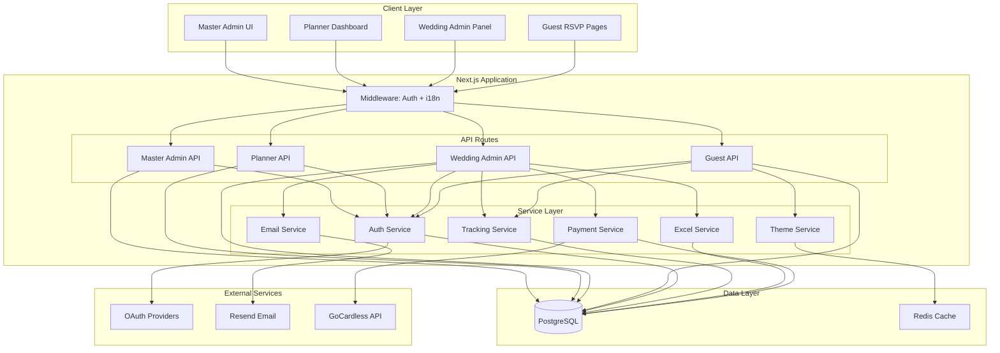
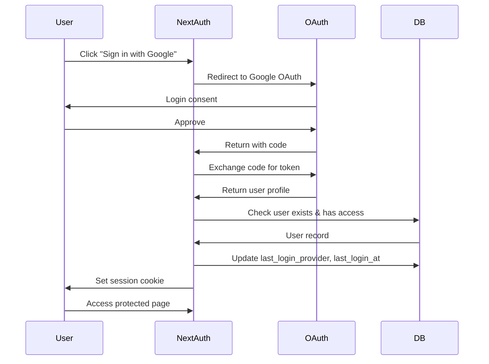
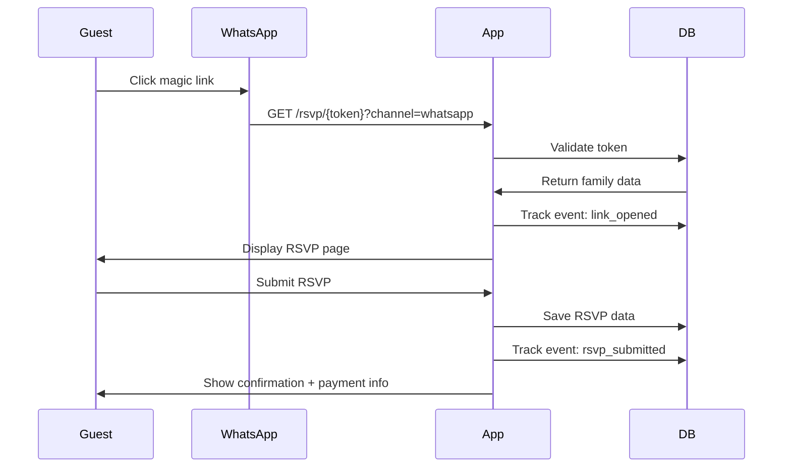

# Design Document: Wedding Management App MVP

## Overview

The Wedding Management App is a multi-tenant SaaS platform built with a modern TypeScript stack. The system provides three distinct user interfaces: a master admin panel for platform management, a wedding planner dashboard for managing multiple weddings, wedding admin panels for couples to manage their specific wedding, and a guest-facing RSVP system accessible via persistent magic links.

The architecture emphasizes **data isolation** through multi-tenancy, **modular design** with clear separation of concerns, and **mobile-first** responsive interfaces optimized for WhatsApp in-app browsers.

## Steering Document Alignment

### Technical Standards

Since this is a new project without existing steering documents, this design establishes the following technical standards:

- **Language**: TypeScript for type safety across frontend and backend
- **Backend Framework**: Next.js 14+ with App Router for API routes and server-side rendering
- **Database**: PostgreSQL 15+ with Prisma ORM for type-safe database access
- **Authentication**: NextAuth.js for OAuth providers, custom magic link implementation
- **Internationalization**: next-intl for translations with JSON files and database storage
- **UI Framework**: React 18+ with Tailwind CSS for mobile-first responsive design
- **Email**: Resend for transactional emails
- **Testing**: Jest for unit tests, Playwright for E2E tests

### Project Structure

```
wedding/
├── src/
│   ├── app/                      # Next.js App Router
│   │   ├── api/                  # API routes
│   │   │   ├── auth/             # NextAuth.js handlers
│   │   │   ├── master/           # Master admin APIs
│   │   │   ├── planner/          # Wedding planner APIs
│   │   │   ├── admin/            # Wedding admin APIs
│   │   │   └── guest/            # Guest RSVP APIs
│   │   ├── master/               # Master admin UI
│   │   ├── planner/              # Planner dashboard UI
│   │   ├── admin/                # Wedding admin UI
│   │   ├── rsvp/                 # Guest RSVP pages
│   │   └── layout.tsx            # Root layout
│   ├── components/               # Shared React components
│   │   ├── ui/                   # Base UI components (buttons, inputs, etc.)
│   │   ├── master/               # Master admin components
│   │   ├── planner/              # Planner components
│   │   ├── admin/                # Wedding admin components
│   │   └── guest/                # Guest RSVP components
│   ├── lib/                      # Shared utilities and services
│   │   ├── db/                   # Database client and utilities
│   │   │   └── prisma.ts         # Prisma client singleton
│   │   ├── auth/                 # Authentication utilities
│   │   │   ├── oauth.ts          # OAuth provider configs
│   │   │   ├── magic-link.ts     # Magic link generation/validation
│   │   │   └── middleware.ts     # Auth middleware
│   │   ├── i18n/                 # Internationalization
│   │   │   ├── config.ts         # i18n configuration
│   │   │   ├── server.ts         # Server-side translation
│   │   │   └── client.ts         # Client-side translation
│   │   ├── excel/                # Excel import/export
│   │   │   ├── import.ts         # Guest list import
│   │   │   ├── export.ts         # Data export
│   │   │   └── templates.ts      # Template generation
│   │   ├── email/                # Email service
│   │   │   ├── resend.ts         # Resend client
│   │   │   └── templates/        # Email templates
│   │   ├── tracking/             # Event tracking
│   │   │   └── events.ts         # Tracking event service
│   │   ├── payment/              # Payment integration
│   │   │   ├── gocardless.ts     # GoCardless API client
│   │   │   └── matching.ts       # Payment matching logic
│   │   └── theme/                # Theme system
│   │       ├── engine.ts         # Theme rendering engine
│   │       └── presets.ts        # Pre-built themes
│   ├── types/                    # TypeScript type definitions
│   │   ├── models.ts             # Database model types
│   │   ├── api.ts                # API request/response types
│   │   └── theme.ts              # Theme configuration types
│   └── middleware.ts             # Next.js middleware (auth, i18n)
├── prisma/
│   ├── schema.prisma             # Database schema
│   ├── migrations/               # Migration files
│   └── seed.ts                   # Database seeding
├── public/
│   └── locales/                  # Static translations
│       ├── es/                   # Spanish
│       ├── en/                   # English
│       ├── fr/                   # French
│       ├── it/                   # Italian
│       └── de/                   # German
├── config/
│   └── master-admin.json         # Master admin configuration
└── tests/
    ├── unit/                     # Unit tests
    ├── integration/              # Integration tests
    └── e2e/                      # End-to-end tests
```

## Code Reuse Analysis

Since this is a new project, there is no existing code to reuse. However, the design emphasizes creating reusable modules from the start:

### Planned Reusable Components

- **Authentication Module** (`lib/auth/`): Will be used by all three admin types (master, planner, wedding admin)
- **Database Client** (`lib/db/prisma.ts`): Singleton pattern, shared across all API routes
- **Tracking Service** (`lib/tracking/events.ts`): Used by guest RSVP flows and admin manual actions
- **Theme Engine** (`lib/theme/engine.ts`): Applied to all guest-facing pages
- **i18n Utilities** (`lib/i18n/`): Used in all UI components and API responses

### Integration Points

- **NextAuth.js**: Handles OAuth flows for Google, Facebook/Instagram, Apple
- **Prisma ORM**: Type-safe database access with automatic TypeScript types
- **Next.js Middleware**: Intercepts requests for authentication and language detection
- **Resend API**: Sends invitation emails, reminders, and confirmations
- **GoCardless Bank Account Data API**: Polls bank transactions for payment matching (optional for automated mode)

## Architecture

### System Architecture



### Multi-Tenancy Design

**Data Isolation Strategy**: All queries must include `wedding_id` filtering to ensure complete data separation.

**Implementation**:
1. **Prisma Middleware**: Inject `wedding_id` filter into all queries automatically
2. **API Context**: Extract `wedding_id` from authenticated user session
3. **Validation**: Verify user has access to the requested wedding before any operation

**Example**:
```typescript
// Prisma middleware for automatic wedding_id filtering
prisma.$use(async (params, next) => {
  if (params.model === 'Family' && params.action === 'findMany') {
    params.args.where = {
      ...params.args.where,
      wedding_id: getCurrentWeddingId()
    }
  }
  return next(params)
})
```

### Modular Design Principles

- **Single File Responsibility**: Each service file handles one domain (auth, tracking, email, etc.)
- **Component Isolation**: UI components are small, focused, and reusable (button, form, card, etc.)
- **Service Layer Separation**: Business logic separated from API routes and database access
- **Utility Modularity**: Helper functions grouped by purpose (date formatting, string manipulation, validation)

## Components and Interfaces

### 1. Authentication Service (`lib/auth/`)

**Purpose**: Handles OAuth authentication for admins and magic link generation/validation for guests

**Modules**:
- `oauth.ts`: NextAuth.js configuration with Google, Facebook, Apple providers
- `magic-link.ts`: Generate secure UUIDs, validate tokens, track expiry
- `middleware.ts`: Protect routes, extract user context

**Interfaces**:
```typescript
// OAuth user after authentication
interface AuthenticatedUser {
  id: string
  email: string
  name: string
  role: 'master_admin' | 'planner' | 'wedding_admin'
  wedding_id?: string // null for master admin and planners
  planner_id?: string // null for master admin
  preferred_language: Language
  last_login_provider: OAuthProvider
}

// Magic link generation
function generateMagicLink(family_id: string): Promise<MagicLink>
function validateMagicLink(token: string): Promise<Family | null>

// Middleware
function requireAuth(role: UserRole): NextMiddleware
function extractUserContext(req: NextRequest): Promise<AuthenticatedUser>
```

**Dependencies**: NextAuth.js, Prisma, crypto

**Reuses**: Prisma client for database access

### 2. Database Service (`lib/db/`)

**Purpose**: Provides type-safe database access with multi-tenancy support

**Modules**:
- `prisma.ts`: Singleton Prisma client with connection pooling
- `middleware.ts`: Automatic wedding_id filtering

**Interfaces**:
```typescript
// Singleton pattern
function getPrismaClient(): PrismaClient

// Multi-tenant context
interface TenantContext {
  wedding_id: string
  user_id: string
  user_role: UserRole
}

// Scoped client with automatic filtering
function getScopedClient(context: TenantContext): PrismaClient
```

**Dependencies**: Prisma, PostgreSQL

### 3. Tracking Service (`lib/tracking/events.ts`)

**Purpose**: Log all guest interactions and admin actions for analytics and notifications

**Interfaces**:
```typescript
enum EventType {
  LINK_OPENED = 'link_opened',
  RSVP_STARTED = 'rsvp_started',
  RSVP_SUBMITTED = 'rsvp_submitted',
  RSVP_UPDATED = 'rsvp_updated',
  GUEST_ADDED = 'guest_added',
  PAYMENT_RECEIVED = 'payment_received',
  REMINDER_SENT = 'reminder_sent'
}

interface TrackingEvent {
  id: string
  family_id: string
  wedding_id: string
  event_type: EventType
  channel?: Channel
  metadata?: Record<string, any>
  admin_triggered: boolean
  timestamp: Date
}

// Create tracking event
function trackEvent(event: Omit<TrackingEvent, 'id' | 'timestamp'>): Promise<void>

// Query events with filters
interface EventFilter {
  wedding_id: string
  family_id?: string
  event_type?: EventType[]
  channel?: Channel
  date_from?: Date
  date_to?: Date
}

function getEvents(filter: EventFilter): Promise<TrackingEvent[]>
```

**Dependencies**: Prisma

**Reuses**: Database client

### 4. Excel Service (`lib/excel/`)

**Purpose**: Import guest lists from Excel and export data to Excel/CSV

**Modules**:
- `import.ts`: Parse Excel, validate data, bulk insert families
- `export.ts`: Generate Excel files from database data
- `templates.ts`: Create downloadable Excel templates

**Interfaces**:
```typescript
interface ExcelRow {
  family_name: string
  contact_person: string
  email?: string
  phone?: string
  whatsapp?: string
  language?: Language
  members: {
    name: string
    type: 'adult' | 'child' | 'infant'
    age?: number
  }[]
}

interface ImportResult {
  success: boolean
  families_imported: number
  errors: { row: number; message: string }[]
  warnings: { row: number; message: string }[]
}

// Import guest list
function importGuestList(
  wedding_id: string,
  file: Buffer
): Promise<ImportResult>

// Export guest data
function exportGuestData(
  wedding_id: string,
  format: 'xlsx' | 'csv'
): Promise<Buffer>

// Generate template
function generateTemplate(): Promise<Buffer>
```

**Dependencies**: xlsx, Prisma

**Reuses**: Database client, Magic link generation

### 5. Email Service (`lib/email/`)

**Purpose**: Send transactional emails in multiple languages

**Modules**:
- `resend.ts`: Resend API client wrapper
- `templates/`: Email template functions with i18n support

**Interfaces**:
```typescript
enum EmailTemplate {
  PLANNER_INVITATION = 'planner_invitation',
  ADMIN_INVITATION = 'admin_invitation',
  RSVP_REMINDER = 'rsvp_reminder',
  RSVP_CONFIRMATION = 'rsvp_confirmation',
  PAYMENT_CONFIRMATION = 'payment_confirmation'
}

interface EmailOptions {
  to: string
  template: EmailTemplate
  language: Language
  variables: Record<string, string>
}

// Send email
function sendEmail(options: EmailOptions): Promise<void>

// Bulk send (e.g., reminders)
function sendBulkEmail(emails: EmailOptions[]): Promise<void>
```

**Dependencies**: Resend, next-intl

**Reuses**: i18n utilities

### 6. Theme Service (`lib/theme/`)

**Purpose**: Render custom themes on guest-facing pages

**Modules**:
- `engine.ts`: Theme CSS generation from JSONB config
- `presets.ts`: 5 pre-built themes (Classic, Garden, Modern, Rustic, Beach)

**Interfaces**:
```typescript
interface ThemeConfig {
  colors: {
    primary: string
    secondary: string
    accent: string
    background: string
    text: string
  }
  fonts: {
    heading: string
    body: string
  }
  styles: {
    buttonRadius: string
    cardShadow: string
    spacing: string
  }
  images?: {
    logo?: string
    banner?: string
    background?: string
  }
}

interface Theme {
  id: string
  planner_id: string
  name: string
  description: string
  config: ThemeConfig
  is_system_theme: boolean
}

// Get theme for wedding
function getWeddingTheme(wedding_id: string): Promise<Theme>

// Generate CSS from theme config
function generateThemeCSS(theme: Theme): string

// Get all available themes for planner
function getPlannerThemes(planner_id: string): Promise<Theme[]>
```

**Dependencies**: Prisma

**Reuses**: Database client

### 7. Payment Service (`lib/payment/`)

**Purpose**: Integrate with GoCardless for automated payment matching (optional)

**Modules**:
- `gocardless.ts`: GoCardless Bank Account Data API client
- `matching.ts`: Match transactions to families by reference code

**Interfaces**:
```typescript
interface BankTransaction {
  id: string
  amount: number
  reference: string
  transaction_date: Date
  sender_name: string
}

interface PaymentMatch {
  transaction: BankTransaction
  family_id: string | null
  confidence: 'high' | 'medium' | 'low' | 'unmatched'
}

// Poll GoCardless for new transactions
function pollTransactions(
  account_id: string,
  since: Date
): Promise<BankTransaction[]>

// Match transactions to families
function matchPayments(
  wedding_id: string,
  transactions: BankTransaction[]
): Promise<PaymentMatch[]>

// Manually assign payment
function manualAssignPayment(
  wedding_id: string,
  family_id: string,
  amount: number,
  transaction_date: Date
): Promise<void>
```

**Dependencies**: GoCardless SDK, Prisma

**Reuses**: Database client, Tracking service

### 8. Internationalization Service (`lib/i18n/`)

**Purpose**: Provide translations for all UI elements and communications

**Modules**:
- `config.ts`: Supported languages, fallback logic
- `server.ts`: Server-side translation utilities
- `client.ts`: Client-side translation hooks

**Interfaces**:
```typescript
type Language = 'es' | 'en' | 'fr' | 'it' | 'de'

// Get translation
function t(key: string, language: Language, variables?: Record<string, string>): string

// Detect language
function detectLanguage(
  userPreference?: Language,
  browserLanguage?: string,
  weddingDefault?: Language
): Language

// Get all translations for a language
function getTranslations(language: Language): Promise<Record<string, string>>
```

**Dependencies**: next-intl

## Data Models

All models are defined in Prisma schema. Key relationships:

### Core Tables

#### Master Admin
```prisma
model MasterAdmin {
  id                  String    @id @default(uuid())
  email               String    @unique
  name                String
  preferred_language  Language  @default(EN)
  created_at          DateTime  @default(now())
}
```

#### Wedding Planner
```prisma
model WeddingPlanner {
  id                  String    @id @default(uuid())
  email               String    @unique
  name                String
  google_id           String?   @unique
  auth_provider       AuthProvider
  last_login_provider AuthProvider?
  preferred_language  Language  @default(EN)
  logo_url            String?
  enabled             Boolean   @default(true)
  subscription_status SubscriptionStatus @default(ACTIVE)
  created_at          DateTime  @default(now())
  created_by          String
  last_login_at       DateTime?

  weddings            Wedding[]
  themes              Theme[]
}
```

#### Theme
```prisma
model Theme {
  id                      String   @id @default(uuid())
  planner_id              String?
  name                    String
  description             String
  is_default              Boolean  @default(false)
  is_system_theme         Boolean  @default(false)
  config                  Json     // ThemeConfig
  preview_image_url       String?
  created_at              DateTime @default(now())
  updated_at              DateTime @updatedAt

  planner                 WeddingPlanner? @relation(fields: [planner_id], references: [id])
  weddings                Wedding[]

  @@index([planner_id])
}
```

#### Wedding
```prisma
model Wedding {
  id                      String    @id @default(uuid())
  planner_id              String
  theme_id                String?
  couple_names            String
  wedding_date            DateTime
  wedding_time            String
  location                String
  rsvp_cutoff_date        DateTime
  dress_code              String?
  additional_info         String?
  payment_tracking_mode   PaymentMode @default(MANUAL)
  allow_guest_additions   Boolean   @default(true)
  default_language        Language  @default(ES)
  status                  WeddingStatus @default(ACTIVE)
  created_at              DateTime  @default(now())
  created_by              String
  updated_at              DateTime  @updatedAt
  updated_by              String?

  planner                 WeddingPlanner @relation(fields: [planner_id], references: [id])
  theme                   Theme? @relation(fields: [theme_id], references: [id])
  wedding_admins          WeddingAdmin[]
  families                Family[]
  tracking_events         TrackingEvent[]
  notifications           Notification[]

  @@index([planner_id])
  @@index([theme_id])
}
```

#### Wedding Admin
```prisma
model WeddingAdmin {
  id                  String    @id @default(uuid())
  email               String
  name                String
  google_id           String?
  auth_provider       AuthProvider
  last_login_provider AuthProvider?
  preferred_language  Language  @default(EN)
  wedding_id          String
  invited_by          String
  invited_at          DateTime  @default(now())
  accepted_at         DateTime?
  last_login_at       DateTime?
  created_at          DateTime  @default(now())

  wedding             Wedding @relation(fields: [wedding_id], references: [id], onDelete: Cascade)

  @@unique([email, wedding_id])
  @@index([wedding_id])
}
```

#### Family
```prisma
model Family {
  id                  String    @id @default(uuid())
  wedding_id          String
  name                String
  email               String?
  phone               String?
  whatsapp_number     String?
  magic_token         String    @unique @default(uuid())
  reference_code      String?   @unique
  channel_preference  Channel?
  preferred_language  Language  @default(ES)
  created_at          DateTime  @default(now())

  wedding             Wedding @relation(fields: [wedding_id], references: [id], onDelete: Cascade)
  members             FamilyMember[]
  tracking_events     TrackingEvent[]
  gifts               Gift[]
  notifications       Notification[]

  @@index([wedding_id])
  @@index([magic_token])
  @@index([reference_code])
}
```

#### Family Member
```prisma
model FamilyMember {
  id                      String    @id @default(uuid())
  family_id               String
  name                    String
  type                    MemberType
  attending               Boolean?
  age                     Int?
  dietary_restrictions    String?
  accessibility_needs     String?
  added_by_guest          Boolean   @default(false)
  created_at              DateTime  @default(now())

  family                  Family @relation(fields: [family_id], references: [id], onDelete: Cascade)

  @@index([family_id])
}
```

#### Tracking Event
```prisma
model TrackingEvent {
  id                  String    @id @default(uuid())
  family_id           String
  wedding_id          String
  event_type          EventType
  channel             Channel?
  metadata            Json?
  admin_triggered     Boolean   @default(false)
  timestamp           DateTime  @default(now())

  family              Family @relation(fields: [family_id], references: [id], onDelete: Cascade)
  wedding             Wedding @relation(fields: [wedding_id], references: [id], onDelete: Cascade)

  @@index([family_id])
  @@index([wedding_id])
  @@index([event_type])
  @@index([timestamp])
}
```

#### Gift
```prisma
model Gift {
  id                      String    @id @default(uuid())
  family_id               String
  wedding_id              String
  amount                  Decimal
  reference_code_used     String?
  auto_matched            Boolean   @default(false)
  status                  GiftStatus @default(PENDING)
  transaction_date        DateTime
  created_at              DateTime  @default(now())

  family                  Family @relation(fields: [family_id], references: [id], onDelete: Cascade)

  @@index([family_id])
  @@index([wedding_id])
}
```

#### Notification
```prisma
model Notification {
  id                  String    @id @default(uuid())
  wedding_id          String
  family_id           String?
  event_type          EventType
  channel             Channel?
  details             Json
  read                Boolean   @default(false)
  read_at             DateTime?
  admin_id            String
  created_at          DateTime  @default(now())

  wedding             Wedding @relation(fields: [wedding_id], references: [id], onDelete: Cascade)
  family              Family? @relation(fields: [family_id], references: [id], onDelete: Cascade)

  @@index([wedding_id])
  @@index([admin_id])
  @@index([read])
}
```

#### Translation
```prisma
model Translation {
  id          String    @id @default(uuid())
  key         String
  language    Language
  value       String
  context     TranslationContext
  updated_at  DateTime  @updatedAt

  @@unique([key, language])
  @@index([context])
}
```

### Enums

```prisma
enum Language {
  ES
  EN
  FR
  IT
  DE
}

enum AuthProvider {
  GOOGLE
  FACEBOOK
  INSTAGRAM
  APPLE
  MICROSOFT
}

enum PaymentMode {
  AUTOMATED
  MANUAL
}

enum WeddingStatus {
  ACTIVE
  ARCHIVED
  COMPLETED
}

enum MemberType {
  ADULT
  CHILD
  INFANT
}

enum EventType {
  LINK_OPENED
  RSVP_STARTED
  RSVP_SUBMITTED
  RSVP_UPDATED
  GUEST_ADDED
  PAYMENT_RECEIVED
  REMINDER_SENT
}

enum Channel {
  WHATSAPP
  EMAIL
  SMS
}

enum GiftStatus {
  PENDING
  RECEIVED
  CONFIRMED
}

enum TranslationContext {
  ADMIN
  GUEST
  PLANNER
}

enum SubscriptionStatus {
  ACTIVE
  INACTIVE
}
```

## API Architecture

### API Route Structure

All APIs follow RESTful conventions with consistent response formats.

#### Master Admin APIs (`/api/master/`)

```
GET    /api/master/planners              # List all planners
POST   /api/master/planners              # Create planner
PATCH  /api/master/planners/:id          # Update planner (enable/disable)
GET    /api/master/weddings              # List all weddings (read-only)
GET    /api/master/analytics             # Platform analytics
```

#### Planner APIs (`/api/planner/`)

```
GET    /api/planner/weddings             # List planner's weddings
POST   /api/planner/weddings             # Create wedding
GET    /api/planner/weddings/:id         # Get wedding details
PATCH  /api/planner/weddings/:id         # Update wedding
POST   /api/planner/weddings/:id/admins  # Invite wedding admin
DELETE /api/planner/weddings/:id/admins/:admin_id # Remove admin

GET    /api/planner/themes               # List themes
POST   /api/planner/themes               # Create theme
PATCH  /api/planner/themes/:id           # Update theme
DELETE /api/planner/themes/:id           # Delete theme (if unused)

GET    /api/planner/stats                # Dashboard stats
```

#### Wedding Admin APIs (`/api/admin/`)

```
GET    /api/admin/wedding                # Get wedding details
PATCH  /api/admin/wedding                # Update wedding config

POST   /api/admin/guests/import          # Import Excel guest list
GET    /api/admin/guests/export          # Export guest data
GET    /api/admin/guests/template        # Download Excel template
GET    /api/admin/guests                 # List all families
PATCH  /api/admin/guests/:id             # Update family

GET    /api/admin/notifications          # Get filtered notifications
PATCH  /api/admin/notifications/:id/read # Mark notification as read
POST   /api/admin/notifications/export   # Export filtered notifications

POST   /api/admin/reminders              # Send manual reminders
GET    /api/admin/reminders/preview      # Preview reminder recipients

GET    /api/admin/payments               # List all payments
POST   /api/admin/payments               # Manually record payment
PATCH  /api/admin/payments/:id           # Update payment status

GET    /api/admin/guest-additions        # List guest-added members
PATCH  /api/admin/guest-additions/:id    # Approve/edit guest addition

POST   /api/admin/admins                 # Invite additional admin
DELETE /api/admin/admins/:id             # Remove admin
```

#### Guest APIs (`/api/guest/`)

```
GET    /api/guest/:token                 # Get family RSVP page data
POST   /api/guest/:token/rsvp            # Submit/update RSVP
POST   /api/guest/:token/member          # Add family member (if allowed)
PATCH  /api/guest/:token/language        # Update language preference
GET    /api/guest/:token/payment         # Get payment information
```

### Authentication Flows

#### OAuth Flow (Admins)



#### Magic Link Flow (Guests)



### Response Format

All API responses follow this structure:

```typescript
interface APIResponse<T> {
  success: boolean
  data?: T
  error?: {
    code: string
    message: string
    details?: any
  }
  meta?: {
    page?: number
    limit?: number
    total?: number
  }
}
```

## Error Handling

### Error Scenarios

#### 1. Magic Token Invalid or Expired
- **Handling**: Return 404 with message "Link not found or expired"
- **User Impact**: Guest sees friendly error page with contact information
- **Recovery**: Wedding admin can regenerate and resend link

#### 2. RSVP Submission After Cutoff Date
- **Handling**: Return 403 with message about cutoff enforcement
- **User Impact**: Guest sees read-only RSVP with "contact us" message
- **Recovery**: Guest contacts couple directly, admin manually updates

#### 3. Excel Import Validation Failures
- **Handling**: Return detailed error report with row numbers and issues
- **User Impact**: Admin sees error summary before any data is imported
- **Recovery**: Admin fixes Excel file and re-uploads

#### 4. OAuth Authentication Failure
- **Handling**: Return to login page with error message
- **User Impact**: User sees "Authentication failed, please try again"
- **Recovery**: User tries different provider or contacts support

#### 5. Multi-Tenancy Violation (Access to Wrong Wedding)
- **Handling**: Middleware intercepts, returns 403 Forbidden
- **User Impact**: Admin sees "Access denied" message
- **Recovery**: User must be invited to the wedding by planner

#### 6. Payment Matching Ambiguity
- **Handling**: Flag as "requires manual review" with suggestions
- **User Impact**: Admin sees unmatched payments list with potential matches
- **Recovery**: Admin manually assigns payment to correct family

#### 7. Theme Deletion with Active Usage
- **Handling**: Return 409 Conflict with count of weddings using theme
- **User Impact**: Planner sees "Cannot delete: used by X weddings"
- **Recovery**: Planner reassigns weddings to different theme first

#### 8. Duplicate Email/Phone in Excel Import
- **Handling**: Flag as warning but allow import with confirmation
- **User Impact**: Admin sees warning summary and chooses to proceed or cancel
- **Recovery**: Admin deduplicates or imports with duplicates knowingly

### Error Logging Strategy

All errors logged with:
- **Timestamp**: When error occurred
- **User Context**: user_id, wedding_id, role
- **Request Context**: Route, method, parameters
- **Error Details**: Stack trace, error message
- **Client Info**: User agent, IP (anonymized)

Logging levels:
- **ERROR**: System failures, database errors, integration failures
- **WARN**: Validation failures, rate limiting, deprecation warnings
- **INFO**: Successful operations, important state changes
- **DEBUG**: Detailed flow information (development only)

## Testing Strategy

### Unit Testing

**Tools**: Jest, React Testing Library

**Coverage Targets**: 80% minimum

**Focus Areas**:
- **Utilities**: All functions in `lib/` (100% coverage)
- **Components**: All reusable UI components
- **Services**: Auth, tracking, email, Excel, payment, theme services
- **Validation**: Form validation, Excel validation, token validation

**Example Tests**:
```typescript
// lib/auth/magic-link.test.ts
describe('generateMagicLink', () => {
  it('should generate unique UUID v4 tokens', async () => {
    const link1 = await generateMagicLink('family-1')
    const link2 = await generateMagicLink('family-2')
    expect(link1.token).not.toEqual(link2.token)
    expect(link1.token).toMatch(/^[0-9a-f]{8}-[0-9a-f]{4}-4[0-9a-f]{3}-[89ab][0-9a-f]{3}-[0-9a-f]{12}$/)
  })
})

// lib/tracking/events.test.ts
describe('trackEvent', () => {
  it('should create event with correct wedding_id', async () => {
    await trackEvent({
      family_id: 'fam-1',
      wedding_id: 'wed-1',
      event_type: EventType.RSVP_SUBMITTED,
      channel: Channel.WHATSAPP,
      admin_triggered: false
    })
    const events = await getEvents({ wedding_id: 'wed-1' })
    expect(events).toHaveLength(1)
    expect(events[0].family_id).toBe('fam-1')
  })
})
```

### Integration Testing

**Tools**: Jest with Prisma test client

**Database Strategy**: Separate test database, reset between tests

**Focus Areas**:
- **API Routes**: All CRUD operations with authentication
- **Multi-Tenancy**: Verify data isolation between weddings
- **OAuth Flows**: Mock OAuth providers, test full authentication
- **Excel Import/Export**: End-to-end file processing
- **Payment Matching**: GoCardless webhook handling (mocked)

**Example Tests**:
```typescript
// __tests__/integration/api/admin/guests.test.ts
describe('POST /api/admin/guests/import', () => {
  it('should import families and generate magic tokens', async () => {
    const file = createTestExcelFile()
    const response = await request(app)
      .post('/api/admin/guests/import')
      .set('Authorization', `Bearer ${weddingAdminToken}`)
      .attach('file', file)

    expect(response.status).toBe(200)
    expect(response.body.data.families_imported).toBe(10)

    const families = await prisma.family.findMany({ where: { wedding_id: 'test-wedding' }})
    expect(families).toHaveLength(10)
    families.forEach(f => expect(f.magic_token).toBeTruthy())
  })
})
```

### End-to-End Testing

**Tools**: Playwright

**Environments**: Staging environment with test data

**Focus Areas**:
- **Complete User Flows**: From login to RSVP submission
- **Multi-Device**: Test on mobile, tablet, desktop
- **Multi-Browser**: Chrome, Firefox, Safari, WhatsApp in-app browser
- **Multi-Language**: Test all 5 languages
- **Theme Rendering**: Verify custom themes apply correctly

**Critical User Journeys**:
1. **Master Admin Journey**:
   - Sign in with OAuth
   - Add new planner
   - Disable planner
   - View all weddings

2. **Planner Journey**:
   - Sign in with OAuth (test provider reminder)
   - Create wedding with theme
   - Invite wedding admin
   - View wedding list

3. **Wedding Admin Journey**:
   - Accept invitation via email
   - Import guest list from Excel
   - View guest dashboard with filters
   - Send manual reminders
   - Record manual payment
   - Export guest data

4. **Guest Journey** (Most Critical):
   - Click magic link from WhatsApp
   - View RSVP page in Spanish
   - Switch language to English
   - Select attending members
   - Add dietary restrictions
   - Submit RSVP
   - View payment information
   - Return via link and edit RSVP
   - Verify cutoff enforcement (read-only after date)

**Example E2E Test**:
```typescript
// tests/e2e/guest-rsvp-flow.spec.ts
test('Guest can complete RSVP flow via magic link', async ({ page }) => {
  // Generate magic link for test family
  const magicLink = await generateTestMagicLink('test-family-id')

  // Open link (simulating WhatsApp click)
  await page.goto(`${magicLink}?channel=whatsapp`)

  // Should see personalized welcome
  await expect(page.locator('h1')).toContainText('Familia García')

  // Select attending members
  await page.check('[data-testid="member-1-attending"]')
  await page.check('[data-testid="member-2-attending"]')

  // Add dietary restriction
  await page.fill('[data-testid="member-1-dietary"]', 'Vegetarian')

  // Submit RSVP
  await page.click('[data-testid="submit-rsvp"]')

  // Should see confirmation and payment info
  await expect(page.locator('[data-testid="confirmation"]')).toBeVisible()
  await expect(page.locator('[data-testid="payment-info"]')).toBeVisible()

  // Verify tracking event was created
  const events = await getTrackingEvents('test-family-id')
  expect(events.some(e => e.event_type === 'rsvp_submitted')).toBe(true)
  expect(events.some(e => e.channel === 'whatsapp')).toBe(true)
})
```

### Performance Testing

**Tools**: Apache JMeter, Lighthouse

**Metrics**:
- **Page Load**: < 2 seconds on 3G
- **API Response**: < 500ms for 95th percentile
- **Database Queries**: < 100ms for typical queries
- **Excel Import**: < 10 seconds for 500 families
- **Theme Rendering**: No visual jank, smooth transitions

**Load Testing Scenarios**:
- 100 concurrent guests accessing RSVP pages
- 10 wedding admins importing guest lists simultaneously
- 1000 tracking events per minute

## Security Considerations

### Authentication Security

- **OAuth State Parameter**: Prevent CSRF attacks on OAuth callbacks
- **Session Security**: HTTP-only, secure cookies with 7-day expiration
- **Token Rotation**: Refresh tokens on each request
- **Provider Verification**: Verify email domains match expected patterns

### Magic Link Security

- **Cryptographic Randomness**: Use crypto.randomUUID() for tokens
- **No Predictable Patterns**: Never use sequential IDs or timestamps
- **Single-Use Option**: Consider making links one-time use (future enhancement)
- **Rate Limiting**: Limit link generation to prevent abuse

### Multi-Tenancy Security

- **Automatic Filtering**: Prisma middleware enforces wedding_id on all queries
- **Context Validation**: Verify user has access before any operation
- **Row-Level Security**: Consider PostgreSQL RLS for additional layer
- **Audit Logging**: Log all cross-tenant access attempts

### Input Validation

- **Zod Schemas**: Validate all API inputs with Zod
- **Excel Sanitization**: Strip formulas, validate data types
- **SQL Injection Prevention**: Prisma parameterized queries only
- **XSS Prevention**: Sanitize user input, use React's built-in escaping

### Data Privacy

- **GDPR Compliance**: Provide data export and deletion capabilities
- **Email Encryption**: Store emails hashed for privacy (consider)
- **PII Minimization**: Only collect necessary guest information
- **Anonymized Analytics**: Remove PII from tracking events for analytics

## Deployment Architecture

### Infrastructure

- **Hosting**: Hetzner VPS (CPX41: 8 vCPUs, 16GB RAM, 240GB SSD)
- **OS**: Ubuntu 22.04 LTS
- **Reverse Proxy**: Nginx with SSL termination
- **SSL**: Let's Encrypt with auto-renewal
- **Domain**: Custom domain with DNS managed separately

### Application Deployment

- **Container**: Docker with docker-compose
- **Process Manager**: PM2 for Node.js process management
- **Database**: PostgreSQL 15 in separate container with persistent volumes
- **Cache**: Redis in separate container (optional for MVP)

### Docker Compose Structure

```yaml
version: '3.8'

services:
  app:
    image: wedding-app:latest
    container_name: wedding-app
    restart: always
    ports:
      - "3000:3000"
    environment:
      - NODE_ENV=production
      - DATABASE_URL=postgresql://user:pass@db:5432/wedding
    depends_on:
      - db
    volumes:
      - ./uploads:/app/uploads
      - ./logs:/app/logs

  db:
    image: postgres:15
    container_name: wedding-db
    restart: always
    environment:
      - POSTGRES_USER=wedding
      - POSTGRES_PASSWORD=${DB_PASSWORD}
      - POSTGRES_DB=wedding
    volumes:
      - db-data:/var/lib/postgresql/data
    ports:
      - "5432:5432"

  nginx:
    image: nginx:alpine
    container_name: wedding-nginx
    restart: always
    ports:
      - "80:80"
      - "443:443"
    volumes:
      - ./nginx.conf:/etc/nginx/nginx.conf
      - ./ssl:/etc/nginx/ssl
    depends_on:
      - app

volumes:
  db-data:
```

### CI/CD Pipeline

1. **Code Push**: Developer pushes to `main` branch
2. **GitHub Actions**: Run tests, lint, type-check
3. **Build**: Create Docker image
4. **Deploy**: SSH to VPS, pull new image, restart containers
5. **Health Check**: Verify application is running
6. **Rollback**: Automatic rollback if health check fails

### Monitoring

- **Application Logs**: Winston logger with daily rotation
- **Database Monitoring**: pg_stat_statements for query analysis
- **Uptime Monitoring**: UptimeRobot for external health checks
- **Error Tracking**: Sentry for error reporting (optional)

### Backup Strategy

- **Database Backups**: Daily PostgreSQL dumps via cron
- **Retention**: 30 days of daily backups
- **Storage**: Backups stored on separate volume and remote backup service
- **Recovery Testing**: Monthly restore test to verify backups

## Future Enhancements (Post-MVP)

These features are documented in the PRD but deferred for later phases:

1. **Seating Chart Management** (Phase 7)
2. **Google Tasks Integration** (Phase 8)
3. **Google Photos Integration** (Phase 9)
4. **Spotify Playlist Integration** (Phase 10)
5. **QR Code Check-in** (Phase 11)
6. **Automated Thank-You Messages** (Phase 12)

These will require additional design documents when prioritized.
